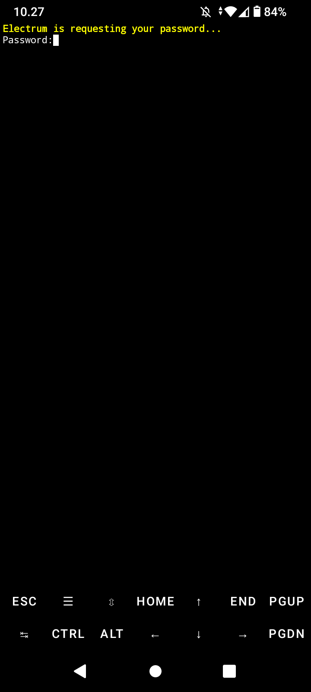
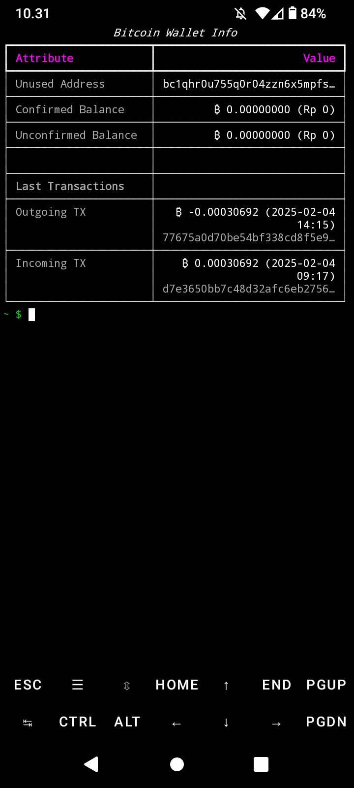
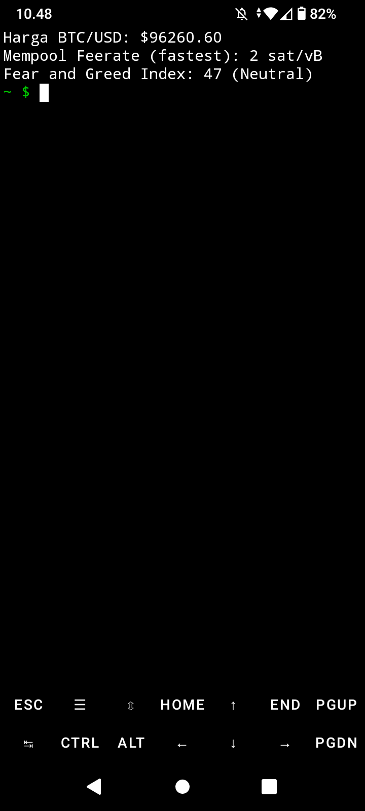
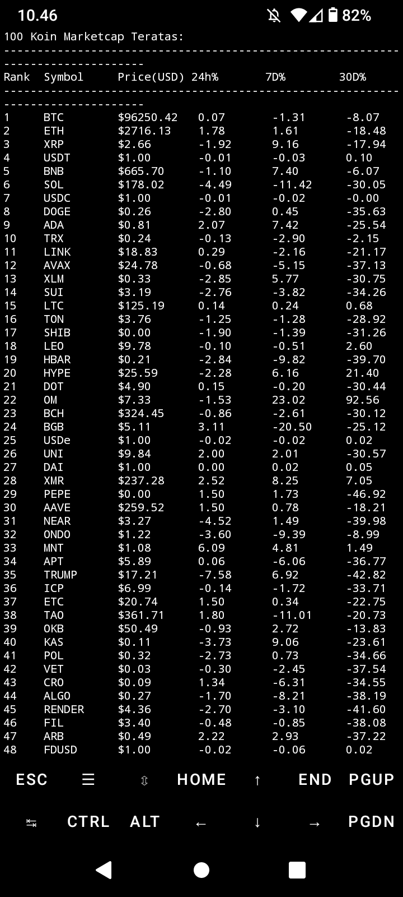
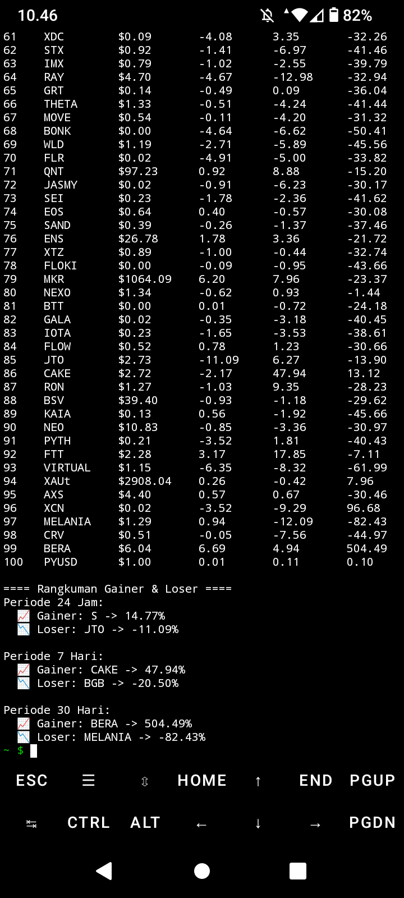

# Bitcoin Wallet Display

Ini adalah kode python yang saya buat khusus untuk menampilkan saldo (UTXO), dan riwayat transaksi secara offline.

  Kode python ini berdasarkan paket electrum-cli yang tersedia di termux. Untuk menggunakannya, ada beberapa dependensi yang perlu diinstall.

Berikut ini adalah langkah-langkahnya:

## Menginstall termux di perangkat android.

Untuk menginstallnya, saya mendownload termux melalui [Github resmi termux](https://github.com/termux/termux-app/releases/download/v0.118.1/termux-app_v0.118.1+github-debug_universal.apk)
  ini untuk versi universal. Anda bisa memilih sesuai dengan versi perangkat anda. Apakah armv8 atau armeabi-v7a.

## Persiapan Sebelum penggunaan

Jalankan perintah dibawah ini di termux:

```
pkg update && pkg upgrade
```
Penginstallan electrum-cli dan dependensi lain:

```
pkg install electrum && pip install rich && pkg install git
```
## clone repository

```
git clone https://github.com/Rovikin/Bitcoin-Wallet-Display.git
cd Bitcoin-Wallet-Display
```

## Konfigurasi

### Permintaan kunci API Coinmarketcap

Setelah filer terdownload, kita perlu sedikit konfigurasi. Beberapa fitur memerlikan API dari Coinmarketcap.

  Anda perlu membuat akun Coinmarketcap jika anda belum memilikinya. Jika anda sudah memiliki akunnya, maka anda bisa dapatkan kunci API nya [disini](https://pro.coinmarketcap.com/account)

  Layanan ini gratis. Anda bisa berlangganan jika anda ingin menggunakan fitur yang jauh lebih lengkap.

Setelah mendapatkan kunci api, silahkan edit file config.json dengan perintah:

```
nano config.json
```
Ganti teks "api-cmc-anda" dengan kunci yang anda dapatkan dari coinmarketcap. Setelah mengganti, anda bisa menyimpan dan keluar dari editor nano dengan tekan tombol CTRL + x, kemudian ketik y dan kemudian ENTER

### Pembuatan Alias

Selanjutnya untuk mempermudah pengetikan perintah, kita perlu sedikit configurasi di .bashrc. Anda bisa buka file editor nano dengan perintah berikut:

```
nano ~/.bashrc
```
Kemudian anda salin  teks dibawah ini:

```
alias btc='cd ~/Bitcoin-Wallet-Display && python btc.py'
alias cmc='cd ~/Bitcoin-Wallet-Display && ./cmc'
alias mem='cd ~/Bitcoin-Wallet-Display && ./mem'
```
 Setelah itu, sama seperti file config.json tadi, ketik CTRL + x kemudian y lalu enter
File .bashrc sudah tersimpan. Untuk membuatnya berfungsi, jalankan perintah:

```
source ~/.bashrc
```

### Keterangan alias:
#### cmc

menampilkan 100 koin teratas berdasarkan Coinmarketcap.

 Ini akan menampilkan harga, perubahan harga dalam 24 jam, 7 hari, dan 30 hari. Serta akan menampilkan koin apa saja yang mengalami performa persentase kenaikan dan penurunan terbesar dalam 24 jam, 7 hari, dan 30 hari terakhir.

#### mem

Menampilkan data harga Bitcoin dalam USD dari [Coinmarketcap](https://www.coinmarketcap.com), feerate dari [mempool.space](https://www.mempool.space), dan fear and greed index dari [alternative.me](https://www.alternative.me)

#### btc

Menampilkan saldo BTC dan riwayat transaksi.

### Konfigurasi Electrum-CLI

Karena kita menggunakan Electrum-CLI, kita perlu membuat atau mengimport wallet kita terlebih dahulu. Untuk alasan keamanan, saya tidak merekomendasikan anda mengimport seed phrase, file backup wallet, ataupun master private key kedalam Electrum-CLI.

Anda bisa ikuti langkah-langkah aman berikut ini

#### Membuat Wallet

Untuk membuat wallet, kita perlu lakukan beberapa langkah sebagai berikut:

```
electrum daemon -d
electrum create
electrum load_wallet
```
setelah wallet terbuat, lihat isi dari default_wallet dengan perintah:

```
cat ~/.electrum/wallets/default_wallet
```
anda akan melihat seed phrase dan xpub / zpub disana.
Salin catat seed phrase nya di kertas dan simpan di tempat yang aman, kemudian anda bisa salin master public key dengan ciri-ciri prefix 'zpub' di depannya.
  Setelah menyimpan seed phrase di kertas. Anda bisa simpan master pubkey dengan perintah

```
nano pubkey.txt
```
paste master pubkey anda disana kemudian tekan CTRL + x kemudian y lalu enter.

#### Restore Wallet

Setelah seed phrase ditulis di kertas dan disimpan di tempat yang aman, kita juga sudah menyimpan master public key di pubkey.txt.
  Langkah selanjutnya adalah restore wallet. Kali ini kita perlu menghapus wallet yang sudah kita simpan untuk alasan keamanan. Karena wallet tersebut berisi private key yang meskipun aman, kita perlu menjaganya dengan tidak membiarkannya ada dalam perangkat android karena perangkat android selalu terhubung ke internet. Meskipun termux adalah lingkungan linux yang terisolasi, kita tidak bisa lepas dari kelalaian kita sendiri. Sehingga perlu untuk menghapusnya.
  Langkah-langkah nya sebagai berikut:

```
cd ~/Bitcoin-Wallet-Display
electrum stop
rm -rf ~/.electrum
electrum daemon -d
electrum restore "$(cat ~/Bitcoin-Wallet-Display/pubkey.txt)"
electrum load_wallet
```

Perintah diatas akan menghapus dan merestore wallet anda yang fungsinya hanya untuk melihat transaksi (watch wallet). Ini akan jauh lebih aman karena tidak ada satupun yang bisa mencuri saldo BTC anda. Termasuk anda sendiri. Tidak perlu khawatir karena kunci pribadi anda (seed phrase) sudah tersimpan di kertas yang anda simpan di tempat yang aman.

Untuk membuatnya jauh lebih aman, anda bisa enkripsi wallet anda dengan perintah berikut:

```
electrum password
```
Sistem akan menampilkan:
```
password:
```
Langsung klik enter, lalu anda diminta memasukkan password baru, silahkan buat password baru yang aman. Terdiri dari gabungan huruf besar, huruf kecil, angka, dan karakter. Setelah mengisi, anda tekan enter. Maka anda akan diminta untuk menginput password baru sekali lagi untuk memastikan bahwa anda tidak salah ketik. Silahkan isi password nya sekali lagi kemudian enter.

  Jika sistem menampilkan:
```
{
"true"
}
```
Maka anda berhasil mengenkripsi wallet anda. Untuk mengakhiri konfigurasi, silahkan jalankan perintah:

```
electrum stop
```
Ini memastikan wallet anda dalam keadaan offline

### Menggunakan dan Menjalankan

Setelah semua konfigurasi diatas sudah berhasil, kita bisa jalankan alat ini dengan sangat mudah.

#### 1. Menampilkan isi wallet

Jalankan:
```
btc
```
Tunggu proses berlangsung sampai terlihat seperti pada tangkapan layar berikut ini:


masukkan password anda kemudian enter
Maka akan menampilkan seperti contoh dibawah ini


#### 2. Menampilkan data harga, feerate mempool, dan fear and greed index

jalankan perintah:
```
mem
```
Maka akan menampilkan seperti gambar berikut ini:


#### Menampilkan 100 kripto marketcap teratas

Jalankan perintah:
```
cmc
```
Dan seperti inilah contoh hasilnya:



### Dukungan dan Ucapan terimakasih

Project ini ditujukan untuk eksperimen, dan untuk memperkenalkan lebih luas penggunaan wallet non custodial dan open source dari [Github resmiELECTRUM](https://github.com/spesmilo/electrum)
Ucapan terimakasih yang sebesar-besarnya kepada pengembang [Electrum](https://www.electrum.org).

Dukungan dan saran sangat terbuka demi pembaruan yang lebih baik.
 Anda bisa mendukung kami dengan mengirimkan donasi melalui alamat Bitcoin berikut ini:
```
bc1qpcsq2pa3k6mdmxscl6cjuumgeyd5cwdnp8gzg0
```

Terimakasih